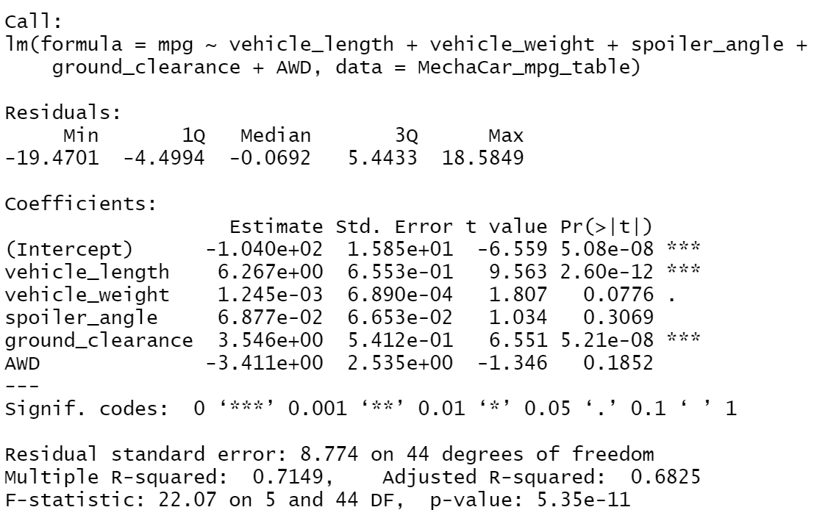
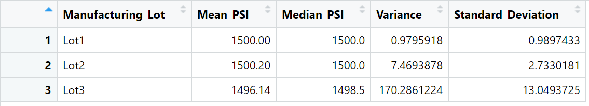

# MechaCar Statistical Analysis

## Linear Regression to Predict MPG

**(1) Which variables/coefficients provided a non-random amount of variance to the mpg values in the dataset?**
According to the results, vehicle length and ground clearance (as well as intercept) are statistically unlikely to provide random amounts of variance to the linear model. In other words the vehicle length and ground clearnace have a significant impact on the milage (mpg). When an intercept is statistically significant, it means that the intercept term explains a significant amount of variability in the dependent variable when all independent vairables are equal to zero.

**(2) Is the slope of the linear model considered to be zero? Why or why not?**
The p-value of our linear regression analysis is 5.35e-11, which is much smaller than our assumed significance level of 0.05%. Therefore, there is sufficient evidence to reject our null hypothesis, which means that the slope of our linear model is not zero.

**(3) Does this linear model predict mpg of MechaCar prototypes effectively? Why or why not?**
The lack of significant variables is evidence of overfitting. Despite the number of significant variables, the r-squared value is 0.7149. 

## Summary Statistics on Suspension Coils

**The design specifications for the MechaCar suspension coils dictate that the variance of the suspension coils must not exceed 100 pounds per square inch. Does the current manufacturing data meet this design specification for all manufacturing lots in total and each lot individually? Why or why not?**
While the variance of the suspension coils is 62.29356 in total, only Lot 1 and 2 meet the design specification with a variance of 0.975918 and 7.4693878 respectively. The variance in Lot 3 of 170.2861224 exceeds the 100 PSI variance threshold.

## T-Tests on Suspension Coils

## Study Design: MechaCar vs Competition
