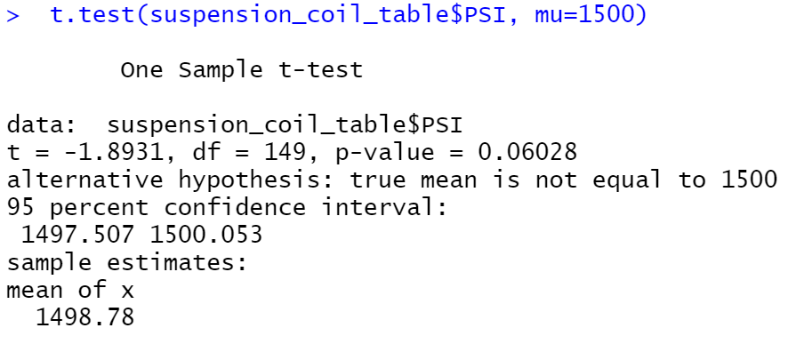
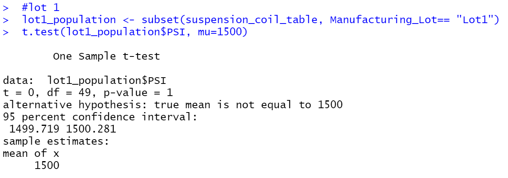
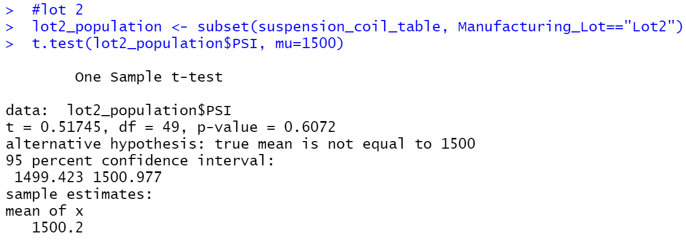
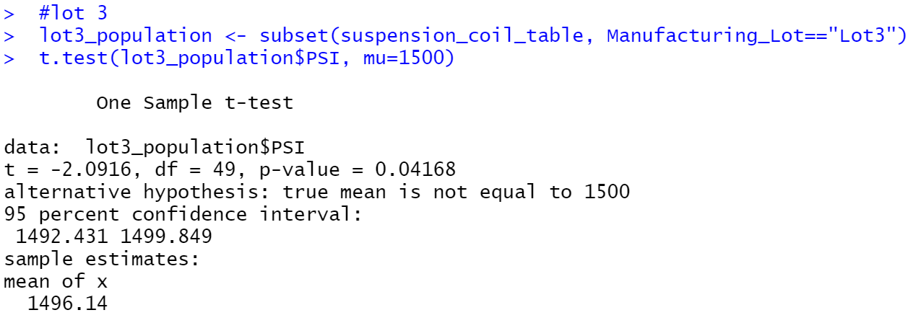

# MechaCar Statistical Analysis

## Linear Regression to Predict MPG

**(1) Which variables/coefficients provided a non-random amount of variance to the mpg values in the dataset?**
According to the results, vehicle length and ground clearance (as well as intercept) are statistically unlikely to provide random amounts of variance to the linear model. In other words the vehicle length and ground clearnace have a significant impact on the milage (mpg). When an intercept is statistically significant, it means that the intercept term explains a significant amount of variability in the dependent variable when all independent vairables are equal to zero.

**(2) Is the slope of the linear model considered to be zero? Why or why not?**
The p-value of our linear regression analysis is 5.35e-11, which is much smaller than our assumed significance level of 0.05%. Therefore, there is sufficient evidence to reject our null hypothesis, which means that the slope of our linear model is not zero.

**(3) Does this linear model predict mpg of MechaCar prototypes effectively? Why or why not?**
The lack of significant variables is evidence of overfitting. Despite the number of significant variables, the r-squared value is 0.7149. 

## Summary Statistics on Suspension Coils

**The design specifications for the MechaCar suspension coils dictate that the variance of the suspension coils must not exceed 100 pounds per square inch. Does the current manufacturing data meet this design specification for all manufacturing lots in total and each lot individually? Why or why not?**
While the variance of the suspension coils is 62.29356 in total, only Lot 1 and 2 meet the design specification with a variance of 0.975918 and 7.4693878 respectively. The variance in Lot 3 of 170.2861224 exceeds the 100 PSI variance threshold.

## T-Tests on Suspension Coils

**Summarize your interpretation and findings for the t-test results**
Assuming the significance level is 0.05
* All Lots: the p-value 0.06026 is above the significance level. Therefore, we do not have sufficient evidence to reject the null hypothesis, and the two means are statistically similar.
* Lot 1: the p-value 1 is above the significance level. Therefore, we do not have sufficient evidence to reject the null hypothesis, and the two means are statistically similar.
* Lot 2: the p-value 0.06072 is above the significance level. Therefore, we do not have sufficient evidence to reject the null hypothesis, and the two means are statistically similar.
* Lot 3: the p-value 0.04168 is below the significance level. Therefore, we **have sufficient evidence** to reject the null hypothesis, and the two means are statistically dissimilar.

## Study Design: MechaCar vs Competition

Using knowledge of R, I've designed a statistical study to compare performance of the MechaCar vehicles against performance of vehicles from other manufacturers.

**What metric or metrics are you going to test?**
I want to know if cars at MechaCar have statistically significant higher safety ratings than the leading manufactures so I would use a one-sample t-test to compare the difference between the mean of MechaCar's safety ratings and the mean of leading manufactures' safety ratings.

**What is the null hypothesis or alternative hypothesis?**
* Null Hypothesis: Given a significance level of 0.05, there is no statistical significance between MechaCar's and the leading manufactures' mean safety rating. 

* Hypothesis: Given a significance level of 0.05, there is a statistical significance between MechaCar's and the leading manufactures' mean safety rating. If the difference is a positive result, then MechaCar manufactures safer cars than leading competitors. If the difference is a negative result, then MechaCar manufactures less safe cars than leading competitors. 

**What statistical test would you use to test the hypothesis? And why?**
Since I want to determine if there a statistical difference between the mean of the sample distribution and the mean of the population distribution, a one-sample t-Test will be used to test the hypothesis. 

**What data is needed to run the statistical test?**
Assuming the dealerships want last year's stock gone before a new model arrives, I would want to compare models from the same year. If wanted to promote next year's model (2023), I would need data for each 2023 model we sold and collect similar 2023 model data from 3-5 other manufacturing companies.

